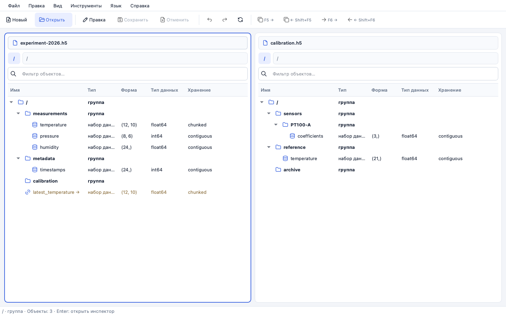
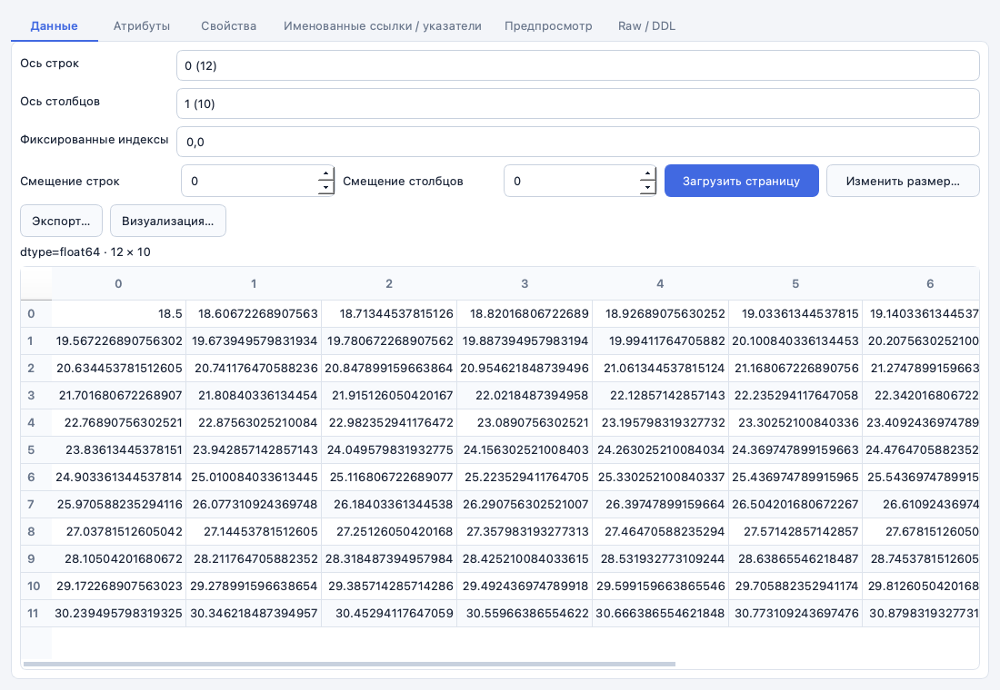
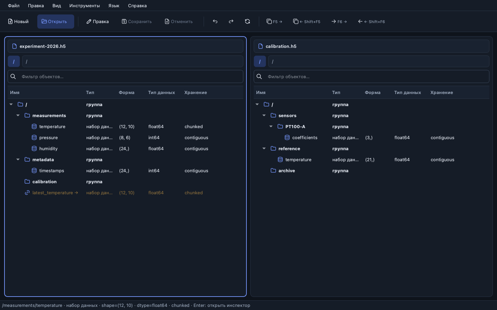
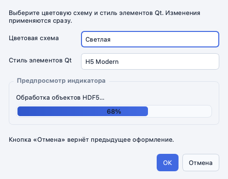

<div align="center">
  <h1>H5 Viewer</h1>
  <p><strong>Современный двухпанельный просмотрщик и безопасный редактор HDF5</strong></p>
  <p>
    Открывайте несколько файлов, исследуйте структуру и метаданные, сравнивайте документы<br>
    и редактируйте данные, не рискуя исходным файлом.
  </p>
  <p>
    
    
    
    
    
  </p>
</div>



## Зачем нужен H5 Viewer

HDF5-файлы могут содержать группы, многомерные наборы данных, атрибуты, именованные типы,
ссылки и графы с циклами. H5 Viewer показывает всю эту структуру в привычной компоновке файлового
менеджера и открывает содержимое выбранного объекта в отдельном инспекторе по клавише `Enter`.

- **Две независимые панели.** Работайте с одним файлом в двух представлениях или откройте разные
  документы слева и справа.
- **Безопасное редактирование.** Все изменения сначала выполняются в рабочей копии; перед
  сохранением файл проверяется, а оригинал заменяется атомарно с созданием резервной копии.
- **Работа с большими файлами.** Группы загружаются постранично, datasets читаются ограниченными
  срезами, а сравнение и экспорт выполняются блоками.
- **Современный интерфейс.** Светлая и тёмная темы, стиль `H5 Modern`, качественные векторные
  иконки, русский и английский языки.

## Скриншоты

### Инспектор многомерного dataset

Данные открываются отдельным окном, поэтому обе навигационные панели сохраняют всю высоту.
Можно выбирать оси, фиксированные индексы и смещения, не загружая dataset целиком.



<table>
  <tr>
    <td width="66%">
      
      <br><sub>Тёмная тема и работа с двумя разными файлами</sub>
    </td>
    <td width="34%">
      
      <br><sub>Выбор темы и базового стиля Qt с живым предпросмотром</sub>
    </td>
  </tr>
</table>

## Возможности

| Область | Что поддерживается |
|---|---|
| Навигация | Один или несколько файлов, две независимые панели, фильтр дерева, ленивый обход больших групп |
| Объекты HDF5 | Группы, datasets, named datatypes, hard/soft/external links, broken links и циклы hard links |
| Метаданные | Атрибуты, dtype, shape, layout, chunks, compression, fill value, object token и DDL-представление |
| Ссылки и шкалы | Object/region references, region selection, dimension scales и структурированные VDS mappings |
| Просмотр данных | Ограниченные страницы N-D datasets, выбор осей и индексов, редактирование поддерживаемых scalar values |
| Анализ | Поиск по путям и метаданным, сравнение структуры, атрибутов и данных с настраиваемым допуском |
| Экспорт | Атомарный экспорт dataset в NPY и текущей двумерной проекции в CSV |
| Визуализация | Line plot и heatmap текущей страницы через опциональный `pyqtgraph` |
| Редактирование | Группы, datasets, атрибуты и ссылки; переименование, удаление, изменение размера, undo/redo |
| Две панели | Копирование объектов клавишей `F5`, перемещение клавишей `F6` внутри файла и между файлами |
| Расширения | Версионированный Python entry-point API и изолированная загрузка плагинов |

Полная матрица реализованных возможностей находится в
[документации поддержки HDF5](docs/hdf5-support-matrix.md).

## Безопасное сохранение

H5 Viewer не изменяет открытый оригинал напрямую:

```text
оригинал → рабочая копия → команды и undo/redo → проверка HDF5
         → резервная копия оригинала → атомарная замена
```

Если файл изменился другой программой после открытия, сохранение блокируется. Уменьшение chunked
dataset дополнительно защищено полным дисковым снимком, необходимым для точного undo.

Подробнее: [протокол безопасного сохранения](docs/safe-saving.md).

## Быстрый старт

Требуется Python 3.10 или новее. После клонирования репозитория перейдите в его каталог.

### macOS и Linux

```bash
python3 -m venv .venv
source .venv/bin/activate
python -m pip install --upgrade pip
python -m pip install -e .
h5viewer
```

### Windows PowerShell

```powershell
py -m venv .venv
.\.venv\Scripts\Activate.ps1
python -m pip install --upgrade pip
python -m pip install -e .
h5viewer
```

Если команда `h5viewer` недоступна, приложение можно запустить напрямую:

```bash
python -m h5viewer
```

### Графики и heatmap

Для визуализации числовых datasets установите опциональное дополнение:

```bash
python -m pip install -e ".[plots]"
```

## Горячие клавиши

| Команда | Клавиша |
|---|---:|
| Открыть файл | `Ctrl+O` |
| Открыть объект в инспекторе | `Enter` |
| Сохранить изменения | `Ctrl+S` |
| Копировать слева направо / справа налево | `F5` / `Shift+F5` |
| Переместить слева направо / справа налево | `F6` / `Shift+F6` |
| Отменить / повторить | `Ctrl+Z` / `Ctrl+Y` (`⌘⇧Z` на macOS) |
| Поиск по метаданным | `Ctrl+F` |
| Сравнить документы панелей | `Ctrl+Shift+C` |
| Обновить структуру | `Ctrl+R` |
| Настройки оформления | `Ctrl+,` |

> На macOS стандартные сочетания Qt отображаются и работают с клавишей `⌘`.

## Сборка desktop-приложения

PyInstaller создаёт самостоятельный пакет для текущей операционной системы:

```bash
python -m pip install -e ".[packaging]"
python scripts/build_desktop.py
```

Результат появится в каталоге `dist/`. GitHub Actions проверяет проект и собирает desktop-пакеты
отдельно для Windows, macOS и Linux. Подробности приведены в
[руководстве по распространению](docs/distribution.md).

## Архитектура

Проект разделён на слои, поэтому интерфейс, HDF5-бэкенд и команды редактирования можно развивать
независимо:

```text
src/h5viewer/
├── domain/          типы и правила предметной области
├── application/     сессии документов и отменяемые команды
├── infrastructure/  работа с h5py, транзакции, экспорт и анализ
├── presentation/qt/ двухпанельный интерфейс PySide6
└── plugins/         публичный API и загрузчик расширений
```

- [Описание архитектуры](docs/architecture.md)
- [Разработка и проверки](docs/development.md)
- [Создание плагинов](docs/plugins.md)
- [Матрица поддержки HDF5](docs/hdf5-support-matrix.md)
- [Безопасное сохранение](docs/safe-saving.md)
- [Сборка и распространение](docs/distribution.md)

## Разработка

Установите инструменты разработчика и запустите все проверки:

```bash
python -m pip install -e ".[dev]"
python -m ruff check .
python -m ruff format --check .
python -m mypy src/h5viewer
python -m pytest
```

Текущий план развития находится в [PLANS.md](PLANS.md). Пример готового расширения — в каталоге
[`examples/object-summary-plugin`](examples/object-summary-plugin).

---

<div align="center">
  H5 Viewer — удобный путь от структуры HDF5 к данным и обратно.
</div>
